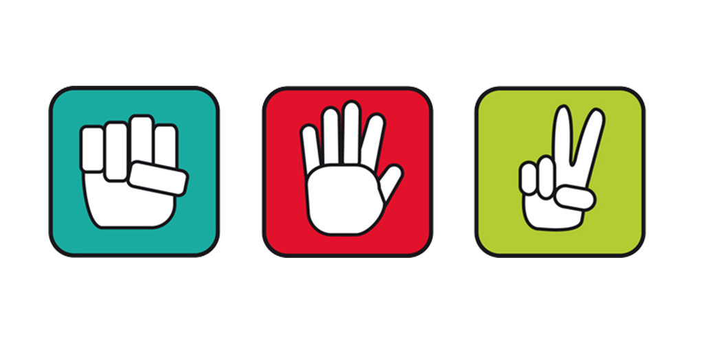

# gym-rpsgame

<p align="center">
	<br>
</p>

***Rock-Paper-Scissor is the simple game that all people can play and enjoy it***

# Table of contents

1. [Game-presentation](#Game-presentation)
	1. [Introduction](#Introduction)
	2. [Object of the game](#Object-of-the-game)
	3. [Gameplay](#Gameplay)
2. [Rules](#Rules)
	1. [Starting-positions](#Starting-positions)
	2. [moves](#moves)

3. [Environments](#Environments)
	1. [Episode termination](#Episode-termination)
	2. [Observations](#Observations)
	3. [Actions](#Actions)
	4. [Reward](#Reward)

4.	[Installation](#Installation)
3.	[Usage](#Usage)
	1. [Opponent player](#opp)
	2. [Agents tournment](#tournment)
	3. [Citation](#Citation)
   	1. [Contribute](#Contribute)


# Game-presentation

https://en.wikipedia.org/wiki/rock_paper_scissor

## Introduction

Rock-Paper-Scissor is a game that it play with hand gesture (left or right). 

gym-rpsgame is an OpenAI RL environment that we can train your agent to play this game.  

## Object of the game

In the game, player must show one of  these three possible action (rock, paper, scissor) where rock beats paper, paper beats scissor and scissor beats rock.

## Gameplay

During the game, player must be stratege by showing rock or paper or scissor and trying to beat its opponent player. If player shows `rock` and its opponent shows `paper` then player looses a game but if player shows scissor and its opponent shows paper then player win the game.

# Rule

## Starting positions

In begining, any players cannot show its hands.

## Moves

Players can move following this three hands:

- **Rock**: the 5 fingers of its hand are closed.
<p align="center">
	<br>
</p>

- **Paper**: the 5 fingers of its hand are openned.
<p align="center">
	<br>
</p>

- **Scissor**: Just two fingers are openned.
<p align="center">
	<br>
</p>

# Environment 

## Observation

The observation is a 1D-numpy array of size (3, ). This array is a dtype=np.float value. This observation are a different hand given by opponent player during a game, step count and score of the game. You can see image below
<p align="center">
	<br>
</p>

## Action 

The action are:

	- rock --> 0

	- paper --> 1

	- scissor --> 2

## Reward

Player have three rewards:

1. If player shows an action greater than an action of opponent player then reward is 1 contrary reward is -1.

2. If player shows an action equal to an action of opponent player then reward is 0.

## Episode termination

The episode is terminated if a step count of game down to zero agent.

# Installation

## Requirement

- python 3.7+
- OpenAI gym
- Numpy
- Pygame
- PIL
- Keras or Tensorflow or Pytorch 

Dependencies can be installed with `pip` or `conda`

## Using pip


```
$ git clone https://github.com/batalong123/gym-rpsgame.git
$ cd gym-rpsgame
$ pip install -e .
```

# Usage


```python

import time
import gym  
import gym_rpsgame


env = gym.make('rps-v0', opponentplayer='statistical')


for i in range(20):

	done = False
	total_reward = 0
	obs = env.reset()
	count = 0

	while not done:

		action = env.action_space.sample()
		obs, reward, done, info = env.step(action)

		total_reward += reward

		env.render()

	print("========== Rock-Paper-Scissor ===========")
	print(f'episode#: {i+1}')
	print(f'Total reward: {total_reward}.')
	print(f'Last game: {info}.\n') 

env.close()
```

## Opponent players

The rock-paper-scissor environment have seven own agents to play against your agent
we have:

 - rock agent: this agent give everytime rock sign.

 - paper agent give paper sign

 - scissor agent give scissor sign

The others agent are copy_opponent, reactionary, counter_reactionay, statistical.


## Agents tournment

You can make agents tournment with rps-v1 environment like this:

```python
import time
import gym  
import gym_rpsgame

env = gym.make('rps-v1')

game = {'win': 0, 'loose': 0, 'draw': 0}
for i in range(20):

	done = False
	total_reward = 0
	obs1, obs2 = env.reset()
	while not done:

		action1 = env.action_space.sample()# random agent1
		action2 = env.action_space.sample()# random agent2
		(obs1, obs2), reward, done, info = env.step([action1, action2])

		total_reward += reward

		if reward > 0: 
			game['win'] += 1 
		elif reward < 0: 
			game['loose'] += 1 
		else: 
			game['draw'] += 1

		env.render()
		env.game.make_gif()
		time.sleep(1.0)
	print("========== Rock-Paper-Scissor ===========")
	print(f'episode#: {i+1}')
	print(f'Total reward: {total_reward}.')
	print(f'Last game: {info}.') 
	#print(f'Last observation: {obs}.')
	print(f'Game: {game}\n')

env.close()
``` 

This environment allows us to compare different agent after trainning.

## Citation

Bibtex if you want to cite this repository in your publications:

```
@misc{gym_rpsgame,
  author = {Massock Batalong M.B.},
  title = {rpsgame Environments for OpenAI Gym},
  year = {2023},
  publisher = {GitHub},
  journal = {GitHub repository},
  howpublished = {\url{https://github.com/batalong123/gym-rpsgame}},
}
```

## Contribute

Feel free to contribute to this project. You can fork this repository and implement whatever you want. Alternatively, open a new issue in case you need help or want to have a feature added.


